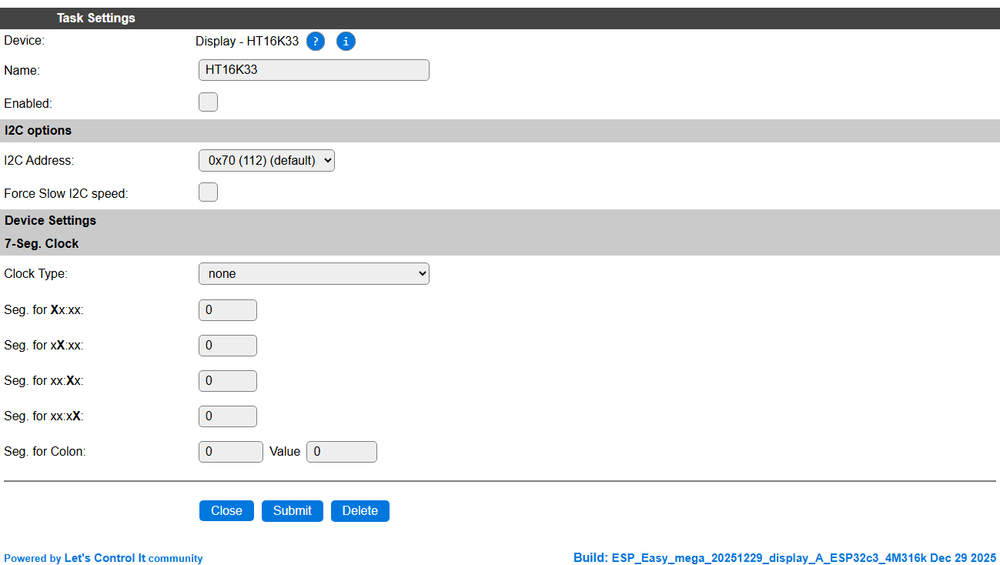
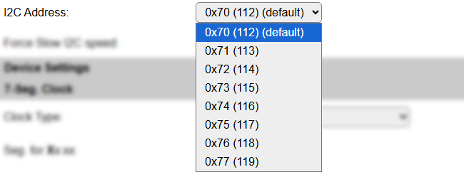

.. include:: ../Plugin/_plugin_substitutions_p05x.repl
.. _P057_page:

|P057_typename|
==================================================

|P057_shortinfo|

Plugin details
--------------

Type: |P057_type|

Name: |P057_name|

Status: |P057_status|

GitHub: |P057_github|_

Maintainer: |P057_maintainer|

Used libraries: |P057_usedlibraries|

Supported hardware
------------------

|P057_usedby|

Introduction
------------

The HT16K33 16 port generic I/O chip can be configured to act as a LED driver or as a maxtrix-keyboard input. This plugin describes settings for it to be used as a LED / 7-segment display driver.

Configuration
-------------

Task settings
~~~~~~~~~~~~~

* **Name** The name of the task. This should be unique for all devices that are configured. (Initially empty)

* **Enabled** For the device to work it has to be enabled. When checked, the device will be started as soon as the ESP starts. If desired, the device can also be enabled from f.e. a rule by using the ``TaskEnable,<tasknr>`` or ``TaskEnable,<taskname>`` command, or disabled using the corresponding ``TaskDisable,<tasknr>|<taskname>`` commands.

I2C options
^^^^^^^^^^^

* **I2C Address**: Select the address the chip is set for, available options:

The available settings here depend on the build and hardware configuration used. At least the **Force Slow I2C speed** option is available, but selections for the I2C Multiplexer can also be shown. For details see the :ref:`Hardware_page`

Device Settings
~~~~~~~~~~~~~~~

7-Seg. Clock
~~~~~~~~~~~~

* **Clock Type**: Select wether the time should be automatically displayed, in either 24h or 12h format, or ``none``, so other information can be shown, using the commands below.

* **Seg. for Xx:xx**: Choose the segment to be used for the 10-hour digit. Usually 0.

* **Seg. for xX:xx**: Choose the segment to be used for the hour digit. Usually 1.

* **Seg. for xx:Xx**: Choose the segment to be used for the 10-minutes digit. Usually 3 (when a colon is included).

* **Seg. for xx:xX**: Choose the segment to be used for the minutes digit. Usually 4 (when a colon is included).

* **Seg. for Colon**: Choose the segment to be used for the colon sign (if any). usually 2. And the value to be used for lighting up the colon. Usually (also) 2.

Commands available
^^^^^^^^^^^^^^^^^^

.. include:: P057_commands.repl

.. Events
.. ~~~~~~

.. .. include:: P057_events.repl

Change log
----------

.. versionchanged:: 2.0
  ...

  |added| 2025-12-29 Documentation added.

.. versionadded:: 1.0
  ...

  |added|
  Initial release version.

